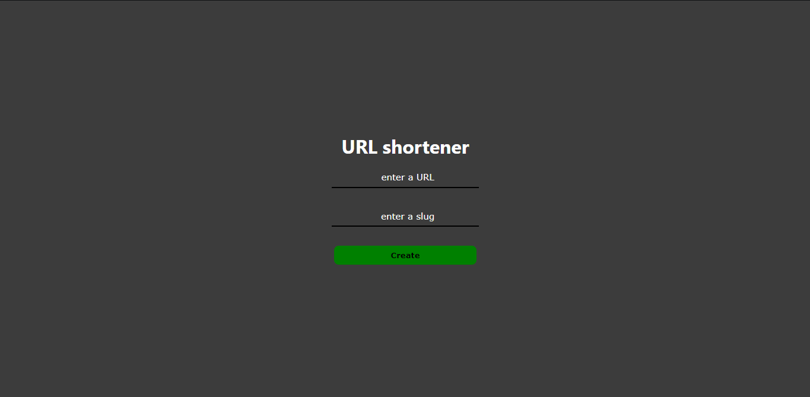

# shorty

A URL shortener app using express mongodb and react.js.

Inspired by [Coding Garden](https://www.youtube.com/watch?v=gq5yubc1u18).

<div align="center">
  <h1><a href="https://shorty.constantine.dev"> DEMO </a></h1>
</div>

Backend deployed to -> https://short-urls.herokuapp.com/

## Usage

Inside the server folder execute the following command for the backend server to start:

```
npm run start
```

You should see the following line:

```
Listening at http://localhost:9999
```

Inside the client folder execute the following command to start the front - end:

```
npm start
```

You should see the following lines:

```
Compiled successfully!

You can now view client in the browser.

  Local:            http://localhost:3000
  On Your Network:  http://<YOUR_IP>:3000

Note that the development build is not optimized.
To create a production build, use npm run build.
```

Also make sure that you have mongodb running locally for the url storing. For windows if you have installed
mongodb server then run the following code from a terminal and leave it open.

```
mongod
```

If it is installed you will see a big output. More info in [MongoDB/Installation](https://docs.mongodb.com/manual/tutorial/install-mongodb-on-windows/).

## Deploy backend to Heroku

From the root of the repo

```bash
heroku create -a short-urls
heroku git:remote -a short-urls
git subtree push --prefix server heroku master
```

## Examples

<p align="center">
   
   
   
</p>
